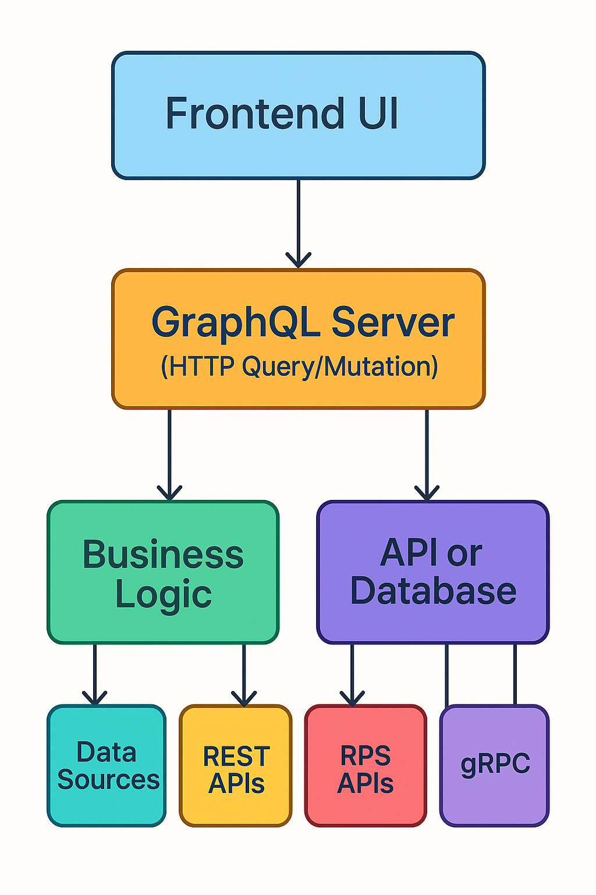

# Episode 1: Introduction to GraphQL

Welcome to **Episode 1** of the GraphQL Mastery Course. In this blog, you'll learn the *what*, *why*, and *how* of GraphQL.

---

## 🧠 What is GraphQL?

GraphQL is a **query language for APIs** and a **runtime for executing those queries** with your existing data.

It was developed by Facebook and open-sourced in 2015. Unlike REST, which exposes multiple endpoints, GraphQL exposes a **single endpoint** that returns exactly the data you need.

---

## 🚀 Why GraphQL?

Traditional REST APIs often have multiple endpoints, each returning fixed data structures. This can lead to:

- **Over-fetching**: Getting more data than needed.
- **Under-fetching**: Making multiple requests to get related data.
- **Tight coupling** between client and server.

GraphQL solves these problems by allowing clients to request exactly the data they need—nothing more, nothing less.

---
## 📌 Key Features

### 1. **Strongly Typed Schema**
Every GraphQL API is defined by a schema that specifies the types and relationships in your data. It acts like a contract between client and server.

```graphql
type Country {
  code: ID!
  name: String!
  native: String
  phone: String
  continent: Continent
  currency: String
  languages: [Language!]!
  states: [State!]!
}
```

---

### 2. **Single Endpoint**
GraphQL uses a single endpoint (`/graphql`) for all requests, unlike REST where each resource has its own URL.

---

### 3. **Declarative Queries**
Clients define the structure of the required response, which helps avoid over-fetching and under-fetching.

```graphql
query {
  country(code: "IN") {
    name
    native
    currency
    languages {
      name
    }
    states {
      name
    }
  }
}
```

---

### 4. **Real-time Data with Subscriptions**
GraphQL supports **subscriptions** for real-time updates using WebSockets. (Note: the Countries API does not support subscriptions, but GraphQL allows it in general.)

---

### 5. **Introspective and Self-Documenting**
You can query the API for details about itself (e.g., types, queries, and mutations). Tools like **GraphiQL** or **GraphQL Playground** leverage this to auto-generate docs.

---

## 🛠 Core Components

| Component    | Description |
|--------------|-------------|
| **Schema**   | Defines the types and operations (queries, mutations, subscriptions) |
| **Query**    | Read-only fetch operation |
| **Mutation** | Write or modify server-side data (not supported in Countries API) |
| **Subscription** | Real-time data stream (not supported in Countries API) |
| **Resolver** | Functions that return data for a field in the schema |

---

## 📊 GraphQL vs REST

| Feature               | GraphQL                          | REST                           |
|------------------------|----------------------------------|--------------------------------|
| Endpoint               | Single (`/graphql`)              | Multiple (`/countries`, `/states`)  |
| Data Fetching          | Client defines shape             | Server defines shape           |
| Over/Under Fetching    | Avoided                          | Common                         |
| Versioning             | Not required                     | Common via `/v1`, `/v2`        |
| Real-Time              | Built-in (via Subscriptions)     | Requires separate setup        |

---

## 🌐 Example Use Case

Using the [Countries GraphQL API](https://countries.trevorblades.com/), you can query for details about countries, their states, and languages in a single request:

```graphql
query {
  countries {
    code
    name
    currency
    languages {
      code
      name
    }
    states {
      name
    }
  }
}
```

Or query a specific country like India:

```graphql
query {
  country(code: "IN") {
    name
    currency
    languages {
      name
    }
    states {
      name
    }
  }
}
```

---

## 📚 Tools & Ecosystem

- **Apollo** – Popular client and server ecosystem
- **Relay** – Facebook’s GraphQL client
- **GraphQL Yoga, urql, Hasura** – Additional tools and platforms

---

## 🧠 When to Use GraphQL

✅ Use GraphQL when:
- You need precise control over data fetching.
- Your frontend is evolving rapidly.
- You have complex data relationships.

❌ Avoid GraphQL when:
- You have simple, CRUD-only APIs.
- You're dealing with binary files (e.g., file uploads—though possible, REST is simpler).

---

## 🧪 Try It Yourself

You can explore this API using:

- [Countries GraphQL Explorer](https://countries.trevorblades.com/)

Try running the following query:

```graphql
query {
  languages {
    code
    name
    native
    rtl
  }
}
```


## 📊 Architecture Diagram

---


<!-- ```
          +-----------------+
          |   Frontend UI   |
          | (React, Vue, etc)|
          +--------+--------+
                   |
                   | HTTP (GraphQL Query/Mutation)
                   v
          +--------+--------+
          |   GraphQL Server |
          |  (Apollo, Yoga, etc) |
          +--------+--------+
                   |
        +----------+-----------+
        |                      |
+---------------+     +------------------+
| Business Logic |     | Authentication/  |
|   Layer        |     | Authorization    |
+-------+--------+     +--------+---------+
        |                        |
        v                        v
+---------------+       +--------------------+
|   Data Sources|       | External Services  |
| (DB, REST API,|       | (Stripe, Firebase, |
|  Microservices)|      |  3rd Party APIs)   |
+---------------+       +--------------------+

``` -->
---

- The client sends a query to the GraphQL server.  
- The server resolves the query using defined resolvers.  
- Data is fetched from various sources (databases, REST APIs, etc.).  

---

## 🎯 Summary

- GraphQL provides a flexible and efficient way to access data.  
- It solves key issues faced by REST APIs.  
- Perfect for modern full-stack applications.  

➡️ Next up: **Setting up a GraphQL server with Express**
