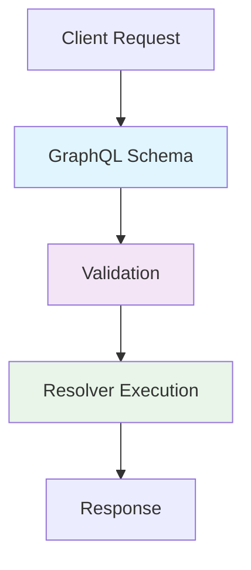
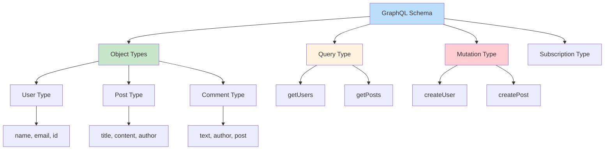
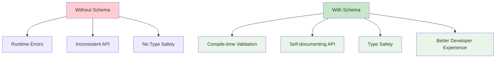
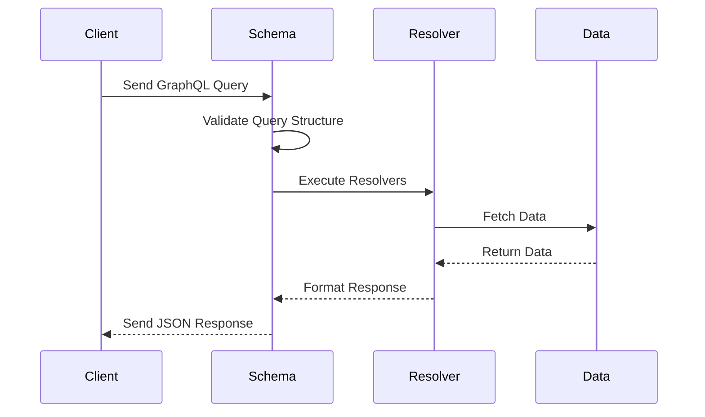
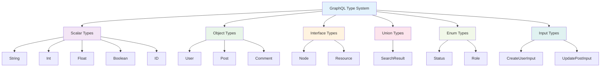
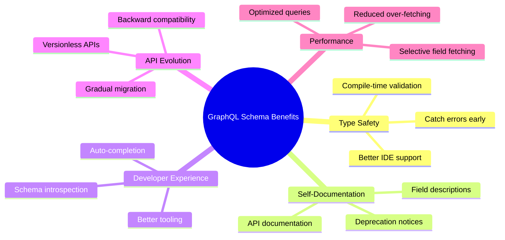
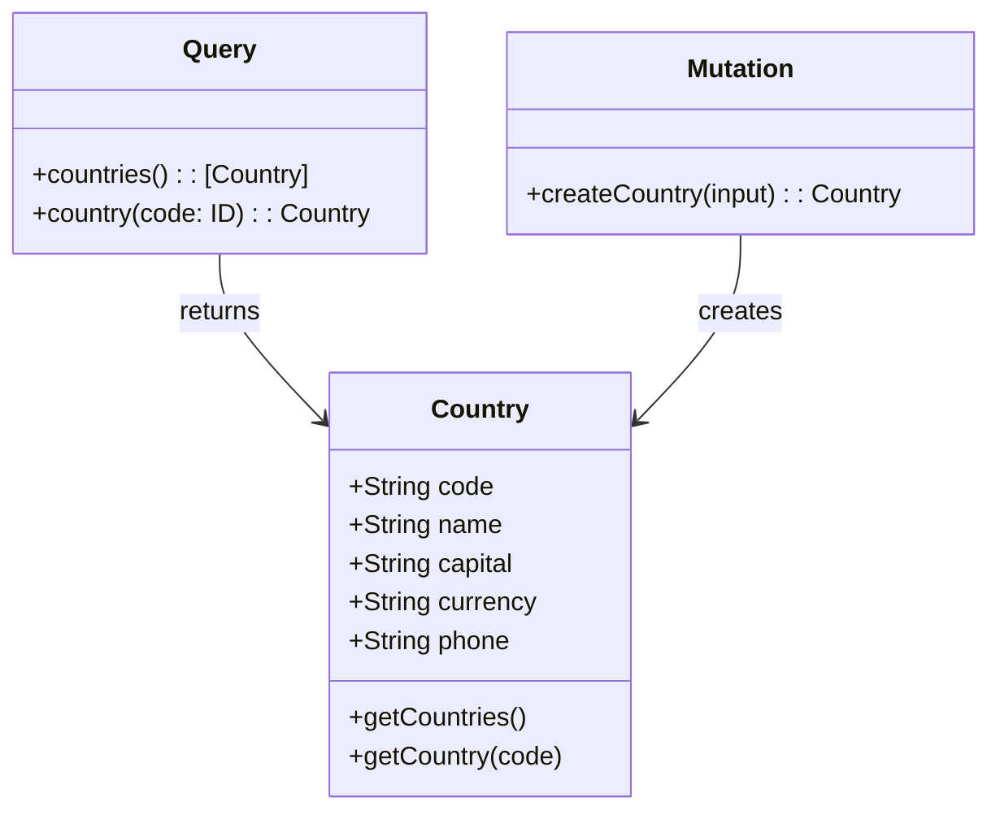
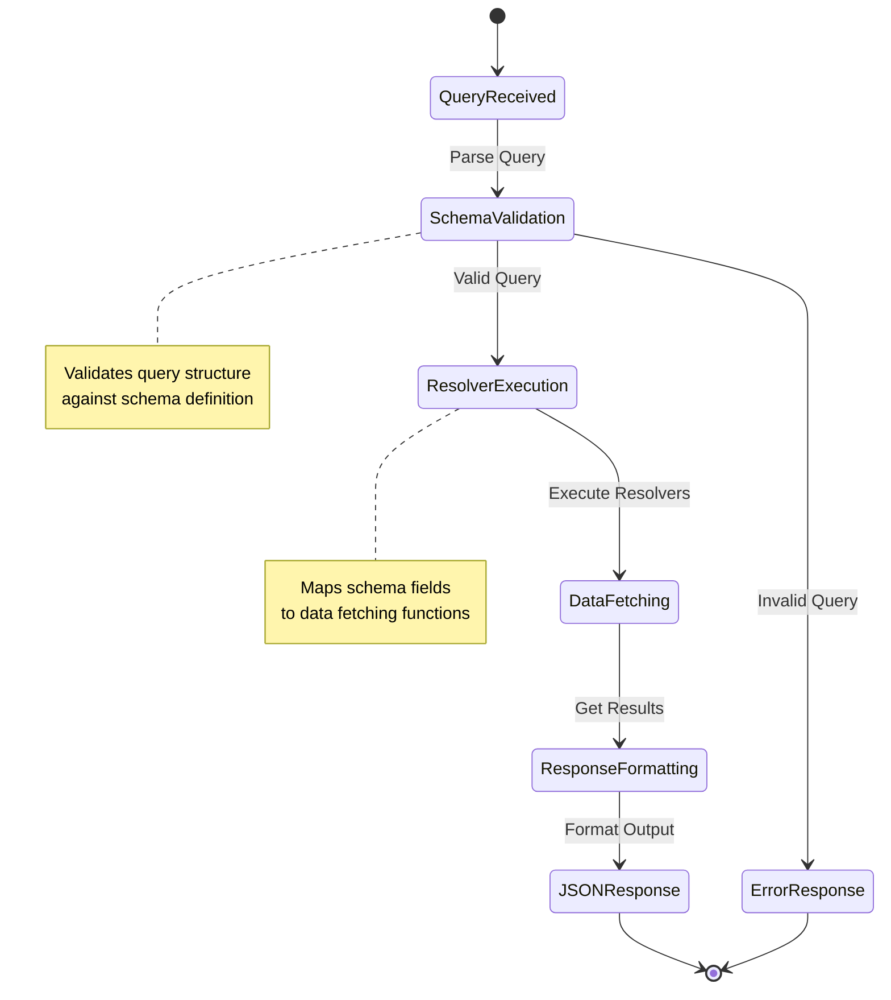

# GraphQL Schema Diagrams - Episode 3

## Interactive Visual Guide
📁 **[graphql-schema-visual.html](graphql-schema-visual.html)** - Interactive HTML page with visual schema explanations

## Text-Based Diagrams
📄 **[graphql-schema-guide.txt](graphql-schema-guide.txt)** - ASCII art diagrams and explanations

## Diagram Creation Instructions
📋 **[diagram-instructions.md](diagram-instructions.md)** - How to create visual diagrams using draw.io

## Existing Diagrams
🖼️ **ER_DIAGRAM.png** - Entity Relationship diagram for college management system
🖼️ **GraphQL-Architecture.png** - General GraphQL architecture diagram
📐 **Untitled Diagram.drawio** - Draw.io file for creating custom diagrams

---

# Relational Diagram for College Student Management System

This diagram shows entities and their relationships in the GraphQL data model.

---

## Entities and Attributes

### Colleges
- **id** (PK)
- name
- location
- establishedYear
- accreditation

### Students
- **id** (PK)
- name
- email
- collegeId (FK → Colleges.id)
- enrollmentYear
- major
- dateOfBirth

### Subjects
- **id** (PK)
- name
- code
- description
- department

### Classes
- **id** (PK)
- title
- collegeId (FK → Colleges.id)
- subjectId (FK → Subjects.id)
- schedule
- instructor

### Marks
- **studentId** (PK, FK → Students.id)
- **classId** (PK, FK → Classes.id)
- score
- grade
- examDate

---

## Relationships

- **College 1:N Students**  
  One college can have many students. Each student belongs to one college.

- **College 1:N Classes**  
  One college offers many classes. Each class belongs to one college.

- **Subject 1:N Classes**  
  One subject can be taught in many classes. Each class is linked to one subject.

- **Student N:M Classes (via Marks)**  
  Students enroll in multiple classes and receive marks.  
  The Marks entity is a join table representing many-to-many relationship between Students and Classes with additional attributes (score, grade, examDate).

---

# ER Diagram for College Student Management System

```mermaid
erDiagram
    COLLEGES {
        string id PK "Primary Key"
        string name
        string location
        int establishedYear
        string accreditation
    }

    STUDENTS {
        string id PK "Primary Key"
        string name
        string email
        string collegeId FK "Foreign Key to COLLEGES.id"
        int enrollmentYear
        string major
        date dateOfBirth
    }

    SUBJECTS {
        string id PK "Primary Key"
        string name
        string code
        string description
        string department
    }

    CLASSES {
        string id PK "Primary Key"
        string title
        string collegeId FK "Foreign Key to COLLEGES.id"
        string subjectId FK "Foreign Key to SUBJECTS.id"
        string schedule
        string instructor
    }

    MARKS {
        string studentId PK FK "Composite PK & FK to STUDENTS.id"
        string classId PK FK "Composite PK & FK to CLASSES.id"
        int score
        string grade
        date examDate
    }

    COLLEGES ||--o{ STUDENTS : "has"
    COLLEGES ||--o{ CLASSES : "offers"
    SUBJECTS ||--o{ CLASSES : "includes"
    STUDENTS ||--o{ MARKS : "receives"
    CLASSES ||--o{ MARKS : "contains"
```

---

# GraphQL Schema Diagrams

This section contains diagrams explaining GraphQL schema concepts for Episode 3.

## What is a GraphQL Schema?

A GraphQL schema is a blueprint that defines the structure of your API. It specifies:
- What data types are available
- What queries and mutations can be performed
- The relationships between different data types



## GraphQL Schema Components



## Why Do We Need GraphQL Schemas?



## Schema Definition Language (SDL) Example

```graphql
type Country {
  code: ID!
  name: String!
  capital: String
  currency: String
  phone: String
}

type Query {
  countries: [Country!]!
  country(code: ID!): Country
}

type Mutation {
  createCountry(input: CreateCountryInput!): Country!
}

input CreateCountryInput {
  name: String!
  capital: String
  currency: String
  phone: String
}
```

## Schema Flow Diagram



## Type System Hierarchy



## Schema vs Traditional REST API

```mermaid
graph TD
    subgraph "Traditional REST API"
        A1[GET /users] --> A2[Returns all user fields]
        A3[GET /users/123] --> A4[Returns user 123]
        A5[POST /users] --> A6[Creates new user]
    end

    subgraph "GraphQL Schema"
        B1[type Query] --> B2[users: [User]]
        B1 --> B3[user(id: ID!): User]
        B4[type Mutation] --> B5[createUser(input: CreateUserInput!): User]
        B6[type User] --> B7[id, name, email, posts]
        B8[type CreateUserInput] --> B9[name, email]
    end

    style A1 fill:#ffcdd2
    style B1 fill:#c8e6c9
    style B4 fill:#c8e6c9
    style B6 fill:#c8e6c9
    style B8 fill:#c8e6c9
```

## Benefits of GraphQL Schema



---

# Episode 3: GraphQL Schema & Type System Diagrams

## Country Schema Example



## Schema Resolution Flow

